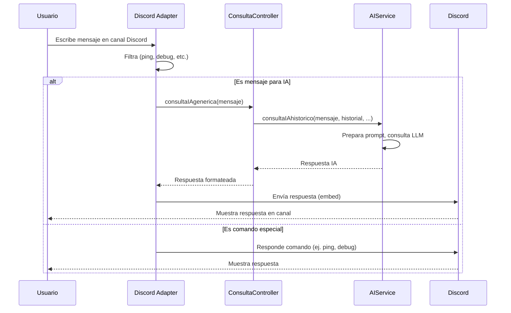

# IAdventure — Arquitectura (dev)

Índice

- Principios
- Arquitectura recomendada (capas)
- Estructura de carpetas sugerida
- Diagrama de secuencias básico
- Diseño IA (prácticas)
- Discord: mejores prácticas
- Persistencia & rendimiento
- Escalado y despliegue
- Observabilidad y costes
- Calidad y mantenimiento
- Roadmap incremental (priorizado)
- Tecnologías / Librerías sugeridas
- Servicios que puedo ofrecer

---

## Principios

- Separación de responsabilidades: comandos/handlers, controladores, servicios (negocio), repositorios (DB), adaptadores externos (Discord, LLM, VectorDB).
- Inyección de dependencias para facilitar tests y swaps (awilix/inversify o pasar dependencias manualmente).
- Tipado: TypeScript para seguridad y refactor seguro.
- Observabilidad: logs estructurados (pino/winston), métricas, captura de errores (Sentry).
- Seguridad y límites: variables de entorno, rotación de tokens, rate limiting, validación y filtrado de outputs IA.
- Testabilidad: unit + integración (jest, msw/nock para mocks HTTP, test doubles para discord.js).

## Arquitectura recomendada (capas)

- Entry points
  - adapters/discord: maneja eventos y transforma a comandos internos.
  - adapters/http: webhooks, healthchecks.
- Controllers: orquestan la lógica por caso de uso (ej. ConsultaController).
- Services: lógica IA, manejo de sesiones, caching, prompts, coste/token management.
- Repositories: abstracción DB (Mongo/Mongoose o Prisma) y cache (Redis).
- Providers / Adapters: LLM provider (OpenAI/Anthropic), Embeddings provider, Vector DB adapter (Pinecone, Weaviate, Milvus).
- Utils / common: validadores, plantillas de prompt, middlewares.

## Estructura de carpetas actual y recomendada

Estructura actual del proyecto:

```
src/
  adapters/         # Adaptadores de entrada/salida (Discord, HTTP, LLM, etc.)
    discord/        # Conector y lógica específica para Discord
      index.ts
    http/           # Adaptador para endpoints HTTP (webhooks, healthchecks)
      index.ts
  config/           # Configuración global y secretos (variables de entorno, settings)
    global.ts
    secrets.ts
  controllers/      # Controladores: orquestan la lógica de cada caso de uso
    consultaController.ts
  json/             # Ficheros de datos estáticos o mocks (ejemplo: gameState.json)
    gameState.json
  lib/              # Librerías utilitarias y helpers (logger, conexión DB, etc.)
    logger.ts
    mongoClient.ts
  models/           # Definición de modelos y tipos de datos (interfaces, esquemas)
    gameState.ts
  scripts/          # Scripts utilitarios para pruebas, migraciones, etc.
    testDb.ts
    testGameStateService.ts
  services/         # Lógica de negocio y servicios de aplicación (IA, sesiones, juego)
    aiService.ts
    gameStateService.ts
    sessionService.ts
  view/             # Presentación y formateo de respuestas (Discord, web, etc.)
    discord.ts
  index.ts          # Entry point principal de la app
```

Estructura recomendada (objetivo a futuro):

```
src/
  adapters/         # Adaptadores de entrada/salida (Discord, HTTP, LLM, VectorDB, etc.)
    discord/        # Conector y lógica específica para Discord
      index.ts
    http/           # Adaptador para endpoints HTTP
      index.ts
    llm/            # Adaptadores para proveedores de LLM (OpenAI, Anthropic...)
      openaiAdapter.ts
      providerFactory.ts
    vector/         # Adaptadores para Vector DB (Pinecone, Weaviate...)
      pineconeAdapter.ts
  controllers/      # Controladores de casos de uso
    consultaController.ts
    dmController.ts
  services/         # Lógica de negocio y servicios de aplicación
    aiService.ts      # RAG, prompts, streaming
    sessionService.ts # historial, tokens
    commandService.ts
    gameStateService.ts
  repositories/     # Abstracción de acceso a datos (DB, cache, etc.)
    userRepo.ts
    gameStateRepo.ts
  models/           # Definición de modelos y tipos de datos
    gameState.ts
    user.ts
  jobs/             # Workers, colas y tareas en background
    # queues, workers para embeddings, reindex, etc.
  config/           # Configuración global y secretos
    index.ts
    global.ts
    secrets.ts
  lib/              # Librerías utilitarias y helpers
    logger.ts
    errorHandler.ts
    mongoClient.ts
  commands/         # Definiciones y lógica de comandos de Discord
    # definiciones de comandos de Discord
  types/            # Tipos globales reutilizables
    # tipos globales reutilizables
  tests/            # Tests unitarios e integración
    # tests unitarios e integración
  view/             # Presentación y formateo de respuestas
    discord.ts
  index.ts          # Entry point principal
```

> Nota: Las carpetas y archivos marcados pueden ir creándose según se avance en el roadmap y se añadan nuevas funcionalidades (ej. workers, nuevos adaptadores, tests, etc.).

---

## Diagrama de secuencias básico




## Diseño IA (prácticas)

- Abstracción del proveedor: poder intercambiar OpenAI/Cohere/Anthropic sin tocar la lógica de negocio.
- Plantillas de prompt y tests automáticos: versionar templates y validar salidas esperadas.
- RAG: indexar documentos/embeddings en Vector DB; recuperar top-K por similitud y anexar contexto.
- Cache de embeddings y respuestas (Redis) para consultas frecuentes.
- Chunking y metadata por documento; usar embeddings por fragmento.
- Controles: classifier de toxicidad + verificación final antes de enviar a Discord.
- Límite de tokens y coste por usuario: contabilizar y avisar.
- Conversación: session id por usuario/hilo y políticas de retención (TTL).

## Discord: mejores prácticas

- Un único router de Interactions en vez de múltiples listeners duplicados.
- Registrar comandos automáticamente con scripts de deploy.
- Manejar botones/modals con customId scheme: `prefijo:tipo:id` (ej. `ai_reply:12345`).
- Respuestas diferidas y streaming: `deferReply` + enviar fragments con `editReply` o `followUp`.
- Uso mínimo de intents necesarios y manejo de partials.

## Persistencia & rendimiento

- DB primaria: MongoDB (+ Mongoose) o PostgreSQL (Prisma) si necesitas relaciones.
- Cache y cola: Redis + BullMQ para jobs de embeddings, reindex, generación larga.
- Vector DB: Pinecone, Weaviate o Milvus para búsquedas semánticas.
- Indexa y crea índices DB (text/compound) para rendimiento.

## Escalado y despliegue

- Docker + GitHub Actions para CI/CD.
- Separar procesos: bot process (event loop) + workers (cola/embeddings).
- Supervisión: Prometheus + Grafana (o servicios SaaS).
- Sharding si crece (discord.js sharding manager).
- Healthchecks y readiness probes.

## Observabilidad y costes

- Loggeo estructurado y con niveles.
- Telemetría de requests hacia LLMs (latencia, tokens, costes).
- Alertas por uso anómalo y límites diarios de tokens.

## Calidad y mantenimiento

- TypeScript + ESLint + Prettier.
- Contract tests para adaptadores externos (usar mocks de LLM).
- Documentación de prompts y decisiones de diseño.
- Suites de tests: unitarios (services/repos), integración (discord adapter stubs).

## Tecnologías / Librerías sugeridas

- Node.js + TypeScript, discord.js v14+
- Mongoose o Prisma + MongoDB/Postgres
- Redis + BullMQ
- Pinecone / Weaviate / Milvus
- OpenAI / Anthropic / Cohere (con adapter)
- pino / winston, Sentry
- jest, msw/nock para tests
- awilix / inversify para DI (opcional)
